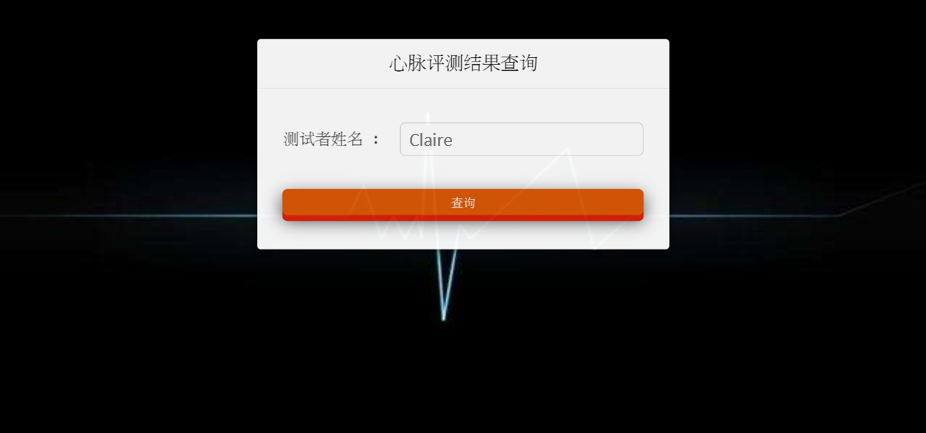
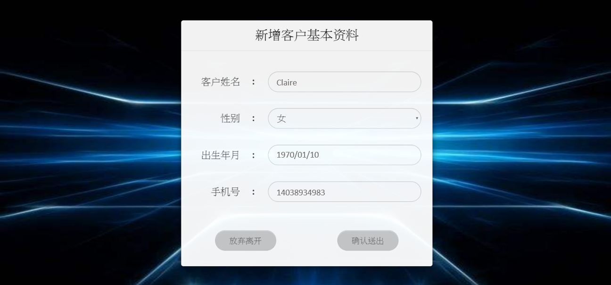
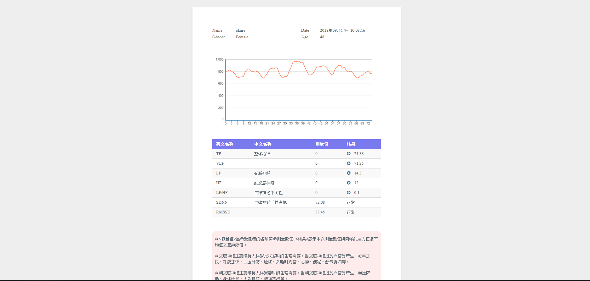

# 1. 評測查詢系統

## 功能
* 輸入要查詢的測試者姓名，並將資料傳往後端去判斷有無此用戶。  
* 若此用戶已存在，則跳轉至評測結果顯示頁面。  
* 若此用戶有測驗紀錄卻尚未註冊會員，則跳轉至註冊頁面。  
* 註冊完後，會跳轉回評測查詢，並自動將姓名填入姓名輸入欄中。  
* 若輸入的姓名無測驗紀錄，則清空欄位，要求使用者重填。 

 

# 2. 會員註冊頁面

## 功能
* 接收使用者在評測查詢系統所輸入的姓名，並且從sqlite資料庫中查詢該測驗者的資料，自動將用戶
  姓名、性别和出生年月日顯示於對應的欄位中。  
* 按確認送出後回到評測查詢系統頁面 

 

# 3. 評測結果顯示頁面

## 功能
* 接收使用者在評測查詢系統所輸入的測試者姓名後，會去sqlite資料庫中取得該位的測驗結果，將結果寫入sql的資料庫中。  
* 利用讀到的資料畫出折線圖，並判斷各項數據是否高於正常值，將其繪製出一個表格中。

